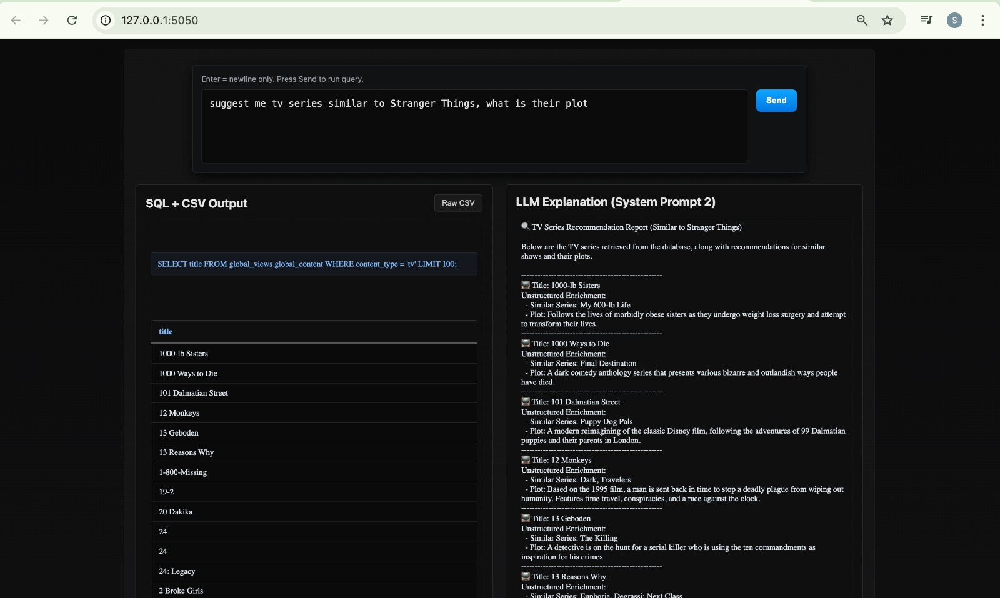

# BingeBox-Information_Integeration_systems
BINGE BOX
Federated Movie & TV Analytics Platform with LLM Integration

Binge Box is a unified platform that demonstrates federated database management, query analysis, virtualization, and LLM-driven unstructured search using Movies and TV Series data.

The project combines three heterogeneous databases into a global federated schema, enabling SQL-based structured queries and LLM-based natural language queries.

The system supports:
-Structured queries (SQL on the global view)
-Unstructured queries (Natural language → SQL via LLM)
-Hybrid reasoning combining description search + metadata

# How to Run the Project
# How to Run the Project  
*Step 1: Clone  
git clone https://github.com/yourusername/BINGE_BOX.git  
cd BINGE_BOX  

*Step 2: Install Dependencies  
pip install -r requirements.txt  

*Step 3: Launch Server  
python3 main.py  

# End user UI: 

  

